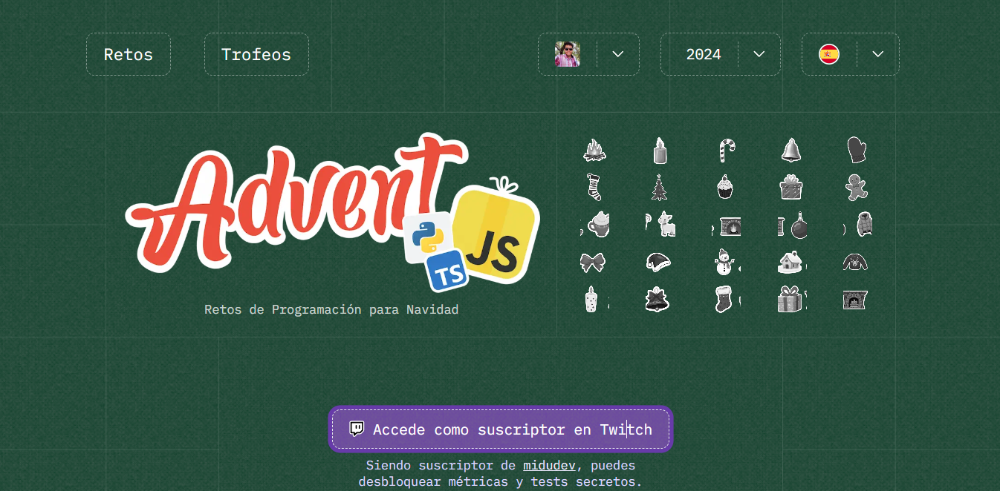

# Advent JS - 20244

En este repositorio estaré subiendo mi resolución a los retos del AdventJS 20244, además de los tests que fueron empleados para comprobar la solución a cada uno de los ejercicios implementados tanto en JavaScript como en TypeScript.

Si quieres practicar y resolver los retos por tu cuenta, entra a [Advent JS](https://adventjs.dev/es)



[AdventJS](https://adventjs.dev/es) es una iniciativa de [@midudev](https://midu.dev/)</strong>

## Retos
---

| Reto  | Titulo    | Solución  | Dificultad[^1]    |
| ----- | --------- | --------- | ----------------- |
| #01   | [¡Primer regalo repetido!](https://adventjs.dev/es/challenges/2024/1) | [Ver Solución](./src/challenge-01/) | 🟢 |
| #02   | [Enmarcando nombres](https://adventjs.dev/es/challenges/2024/2) | [Ver Solución](./src/challenge-02/) | 🟢 |
| #03   | [Organizando el inventario](https://adventjs.dev/es/challenges/2024/3) | [Ver Solución](./src/challenge-03/) | 🟢 |
| #04   | [Decorando el árbol de Navidad](https://adventjs.dev/es/challenges/2024/4) | [Ver Solución](./src/challenge-04/) | 🟠 |
| #05   | [Emparejando botas](https://adventjs.dev/es/challenges/2024/5) | [Ver Solución](./src/challenge-05/) | 🟢 |
| #06   | [¿Regalo dentro de la caja?](https://adventjs.dev/es/challenges/2024/6) | [Ver Solución](./src/challenge-06/) | 🟠 |
| #07   | [El ataque del Grinch](https://adventjs.dev/es/challenges/2024/7) | [Ver Solución](./src/challenge-07/) | 🟠 |
| #08   | [La carrera de renos](https://adventjs.dev/es/challenges/2024/8) | [Ver Solución](./src/challenge-08/) | 🟢 |
| #09   | [El tren mágico](https://adventjs.dev/es/challenges/2024/9) | [Ver Solución](./src/challenge-09/) | 🟠 |
| #10   | [El ensamblador élfico](https://adventjs.dev/es/challenges/2024/10) | [Ver Solución](./src/challenge-10/) | 🟠 |
| #11   | [Nombres de archivos codificados](https://adventjs.dev/es/challenges/2024/11) | [Ver Solución](./src/challenge-11/) | 🟢 |
| #12   | [¿Cuánto cuesta el árbol?](https://adventjs.dev/es/challenges/2024/12) | [Ver Solución](./src/challenge-12/) | 🟢 |
| #13   | [¿El robot está de vuelta?](https://adventjs.dev/es/challenges/2024/13) | [Ver Solución](./src/challenge-13/) | 🔴 |
| #14   | [Acomodando los renos](https://adventjs.dev/es/challenges/2024/14) | [Ver Solución](./src/challenge-14/) | 🟢 |
| #15   | [Dibujando tablas](https://adventjs.dev/es/challenges/2024/15) | [Ver Solución](./src/challenge-15/) | 🟢 |
| #16   | [Limpiando la nieve del camino](https://adventjs.dev/es/challenges/2024/16) | [Ver Solución](./src/challenge-16/) | 🟢 |
| #17   | [Busca las bombas del Grinch](https://adventjs.dev/es/challenges/2024/17) | [Ver Solución](./src/challenge-17/) | 🟠 |
| #18   | [La agenda mágica de Santa](https://adventjs.dev/es/challenges/2024/18) | [Ver Solución](./src/challenge-18/) | 🔴 |
| #19   | [Apila cajas mágicas para repartir regalos](https://adventjs.dev/es/challenges/2024/19) | [Ver Solución](./src/challenge-19/) | 🔴 |
| #20   | [Encuentra los regalos faltantes y duplicados](https://adventjs.dev/es/challenges/2024/20) | [Ver Solución](./src/challenge-20/) | 🟢 |
| #21   | [Calcula la altura del árbol de Navidad](https://adventjs.dev/es/challenges/2024/21) | [Ver Solución](./src/challenge-21/) | 🟢 |
| #22   | [Genera combinaciones de regalos](https://adventjs.dev/es/challenges/2024/22) | [Ver Solución](./src/challenge-22/) | 🟠 |
| #23   | [Encuentra los números perdidos](https://adventjs.dev/es/challenges/2024/23) | [Ver Solución](./src/challenge-23/) | 🟢 |
| #24   | [Verifica si los arboles son espejos mágicos](https://adventjs.dev/es/challenges/2024/24) | [Ver Solución](./src/challenge-24/) | 🟠 |
| #25   | [Ejecuta el lenguaje mágico](https://adventjs.dev/es/challenges/2024/25) | [Ver Solución](./src/challenge-25/) | 🟠 |
| #26   | [Calcula el porcentaje completo](https://adventjs.dev/es/challenges/2024/26) | [Ver Solución](./src/challenge-25/) | 🟢 |

[^1]: **Dificultad**: 🟢 Fácil 🟠 Media 🔴 Difícil 🟣 Muy Difícil

## Instalación

Clona este repositorio usando:

```bash
git clone https://github.com/chicho69-cesar/adventJS-2024.git
```

Instala Jest para realizar los tests de los retos:

```bash
npm install jest, @types/jest
```

## Tests

Puedes comprobar todos los tests de los retos usando el comando:

```bash
npm run jest
```

O También puedes ejecutar los siguientes comandos, para ejecutar tanto todos los tests como los tests individuales de cada reto:

```bash
npm run test # Para correr todos los test de todos los retos
npm run test:n # n siendo el numero del reto, por ejemplo
npm run test:1 # Correrá el test del reto 1
```
